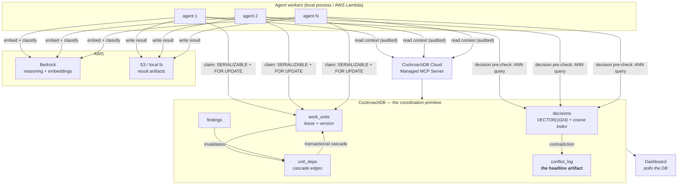

# Quorum

**A shared-memory coordination layer for concurrent AI agents, built on CockroachDB.**

Multiple agents work one large task at the same time against a single shared
memory. The hard part is not the agents — it is that they **contend**:

1. They grab the same work.
2. They reach contradictory conclusions independently, neither aware of the other.
3. One agent's late discovery invalidates work another agent already finished.

Quorum resolves all three using CockroachDB's serializable transactions and
distributed vector index as the coordination primitive.

> **The thesis:** remove CockroachDB and this system does not degrade — it
> produces corrupt, contradictory output. The database is not storage here.
> It is the concurrency control.
>
> That claim is testable, and Quorum ships the test: every workspace runs in
> `safe` or `naive` mode, and `quorum compare` runs the same task, same agents,
> same seed, in both.

---

## Status

Built in phases. This is what currently runs end to end:

| Phase | Scope | State |
|---|---|---|
| 1 | Foundation: schema, migrations, decomposition, seeding, local cluster | **done** |
| 2 | Claim engine: leases, heartbeats, expiry reclaim, contention log | next |
| 3 | Real agents on Amazon Bedrock | planned |
| 4 | Semantic conflict: embeddings, vector search, reconciliation | planned |
| 5 | Invalidation cascade | planned |
| 6 | CockroachDB Cloud Managed MCP Server for agent reads | planned |
| 7 | Dashboard | planned |
| 8 | Cloud profile: CockroachDB Cloud, Lambda, S3 | planned |
| 9 | Demo harness, including a `ccloud` node kill | planned |

Phase 1 is honest about its scope: it builds the shared memory and proves the
*seed* is atomic. The three conflicts land in phases 2, 4, and 5.

---

## The three conflicts

### 1. Claim conflict — two agents grab the same work unit

Resolved by claiming inside a **serializable transaction** with `SELECT … FOR
UPDATE`, a lease (`claimed_by`, `claim_expires_at`), and a heartbeat. An expired
lease is reclaimable, so an agent that dies mid-claim cannot deadlock the
workspace. Every contended claim is written to `conflict_log`, because
contention that is merely *handled* is invisible, and invisible contention
convinces nobody.

### 2. Semantic conflict — two agents reach contradictory conclusions

Agent A decides "standardise the transport layer on `httpx`". Agent B, three
files away, decides "keep the `requests` adapter for the unix socket". Neither
knows about the other, and no keyword match connects those two sentences.

Every decision is embedded on write. Before it commits, an **ANN query over the
distributed vector index** finds near-neighbours in the same workspace and
scope; anything above threshold is classified by Bedrock as `agrees` /
`contradicts` / `unrelated`. On `contradicts`, one decision wins, the loser is
marked `superseded`, and the work built on it is invalidated.

This is the non-negotiable justification for a vector index: `LIKE` cannot tell
that those two sentences are the same argument.

### 3. Invalidation cascade — a late finding invalidates finished work

`unit_deps` is walked transitively from the invalidated node; dependents flip to
`stale`, are re-queued, and get a `version` bump. The **entire cascade commits
in one serializable transaction**, because a half-applied cascade — some
dependents re-queued, others still marked `done` — is exactly the corruption
being claimed against.

---

## Architecture



Full detail in [docs/architecture.md](docs/architecture.md); operational
behaviour in [docs/production-readiness.md](docs/production-readiness.md).

---

## CockroachDB: which features, and what the agents do with them

| CockroachDB capability | What Quorum does with it |
|---|---|
| **`SERIALIZABLE` isolation** (the default) | Claims, seeds, and invalidation cascades run as one transaction each. Anomalies abort with SQLSTATE `40001` rather than committing quietly. |
| **Client-side retry on `40001`** | `run_serializable` replays the whole unit of work with exponential backoff and full jitter, and counts every retry (`TxnStats`) as an observable cost of correctness, not an error. |
| **`SELECT … FOR UPDATE`** | Serialises two agents racing for the same work unit, so exactly one wins the lease and the loser is logged as a contended claim. |
| **`VECTOR(1024)` column type** | Stores Bedrock Titan embeddings for every decision and finding. |
| **Distributed vector index (C-SPANN)** | `CREATE VECTOR INDEX … (workspace_id, embedding vector_cosine_ops)` — an ANN search over prior decisions runs before every decision commits. The `workspace_id` prefix scopes the search to one workspace instead of filtering after the fact. |
| **Partial index** | `INDEX (claim_expires_at) WHERE status = 'claimed'` lets the lease reaper find expired claims without scanning every unit. |
| **`JSONB`** | Work unit specs and conflict details stay schemaless where the domain plugs in, indexed where the engine needs them. |
| **`UUID[]`** | `conflict_log.agents` records exactly who was involved in each conflict. |
| **Autocommit path (deliberately)** | `naive` mode uses no transaction and no retry, giving the demo a control group that fails the way ordinary agent memory fails. |
| **CockroachDB Cloud Managed MCP Server** | Agent *read* paths go through MCP (audited, safe by default). Writes that need isolation stay in the application layer — see the honesty note below. |
| **`ccloud`** | Kills a node mid-run in the demo, to show agents continuing with zero lost work. |

### The MCP split, stated plainly

Agent **reads** go through the CockroachDB Cloud Managed MCP Server: audited,
safe by default, and the right way for an agent to query shared memory.

Agent **writes** that require transactional guarantees do **not**. A claim is
`BEGIN; SELECT … FOR UPDATE; UPDATE; COMMIT` with an explicit retry loop on
`40001` — an isolation contract, not a query. Routing it through a generic tool
layer would mean giving up the control that makes it correct.

Read via MCP, write via controlled transactions. That is the honest split, and
it is a better engineering answer than pretending everything goes through MCP.

---

## AWS services, and how they are used

| Service | Role |
|---|---|
| **Amazon Bedrock** | Agent reasoning (the migration itself) and embeddings (Titan Text Embeddings V2, 1024-d, matching the `VECTOR(1024)` column). Also the judge that classifies two near-neighbour decisions as `agrees` / `contradicts` / `unrelated`. |
| **AWS Lambda** | Agent workers in the cloud profile. The worker entrypoint is Lambda-shaped from the start; the local runner invokes the same handler in a subprocess. |
| **Amazon S3** | Migration artifacts (diffs, rewritten files). `work_units.result_ref` holds the key. Locally this is a directory. |

Local development requires none of them: `QUORUM_LLM_BACKEND=stub`,
`QUORUM_ARTIFACT_BACKEND=local`, `QUORUM_RUNNER=local`.

---

## Setup

Requirements: **Python 3.11+**. That is all — CockroachDB is downloaded on
demand into `.tools/` (gitignored), so there is no Docker requirement and
nothing to install by hand.

```bash
git clone <this repo> && cd Quorum

# Windows
powershell -ExecutionPolicy Bypass -File scripts/bootstrap.ps1

# macOS / Linux
./scripts/bootstrap.sh
```

The bootstrap script creates a virtualenv, installs the package, starts a local
single-node cluster, applies migrations, and seeds a workspace from the vendored
`docker-py` repository. Doing it by hand is four commands:

```bash
python -m venv .venv && .venv/bin/pip install -e ".[dev]"
quorum db up          # download + start local CockroachDB
quorum migrate        # apply versioned schema migrations
quorum seed           # decompose fixtures/docker-py, seed a workspace
```

Configuration is environment-driven. Copy `.env.example` to `.env` to change
anything; the defaults are a complete working local setup. **No secrets belong
in this repo.**

---

## Run

```bash
quorum version                       # resolved profile and backends
quorum db status                     # is the local cluster up?

quorum decompose --units             # what the task decomposes into, no writes
quorum seed --name demo --mode safe  # seed a workspace
quorum seed --name demo-naive --mode naive

quorum workspaces                    # every workspace and its unit counts
quorum status demo                   # units, decisions, conflicts

quorum migrate --status              # which migrations are applied
quorum reset --yes                   # drop and rebuild the database
quorum db down                       # stop the local cluster
```

The DB Console is at <http://127.0.0.1:8080> while the local cluster is running.

### Tests and lint

```bash
pytest                    # 72 tests; integration tests skip if no cluster is up
pytest -m "not integration"
ruff check .
```

Integration tests run against `quorum_test` on the same cluster, so running the
suite never destroys a seeded demo workspace.

---

## The task being coordinated

The reference task migrates [docker-py](https://github.com/docker/docker-py)
(vendored under `fixtures/`, Apache-2.0) off `requests` onto `httpx`. It
decomposes into **16 work units** across **20 real import-graph dependency
edges** and **8 decision scopes**, several shared by four or more files — which
is exactly the overlap that produces semantic conflict.

The engine is domain-agnostic. Decomposition is a plugin
(`quorum.decompose.Decomposer`); code migration is the reference
implementation, not a hardcoded assumption. See
[fixtures/README.md](fixtures/README.md).

---

## Repository layout

```
src/quorum/
  config.py            environment-driven settings, local vs cloud
  logging.py           structured JSON logging
  db.py                pooling, serializable + autocommit paths, retry accounting
  localdb.py           local single-node CockroachDB lifecycle
  migrations/          versioned .sql migrations and their runner
  decompose/           pluggable task decomposition (code migration reference impl)
  workspace.py         atomic seeding, lookup, summaries
  cli.py               the `quorum` command
tasks/                 task specs
fixtures/              vendored real repositories to migrate
docs/                  architecture, production readiness
tests/                 pure tests + integration tests
```

## License

Apache License 2.0 — see [LICENSE](LICENSE).

The vendored fixture is also Apache-2.0 and keeps its own upstream license
notice at `fixtures/docker-py/LICENSE`, unmodified.
