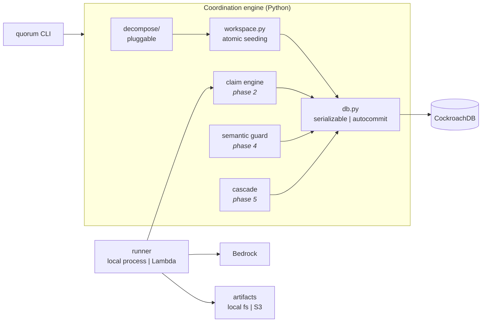
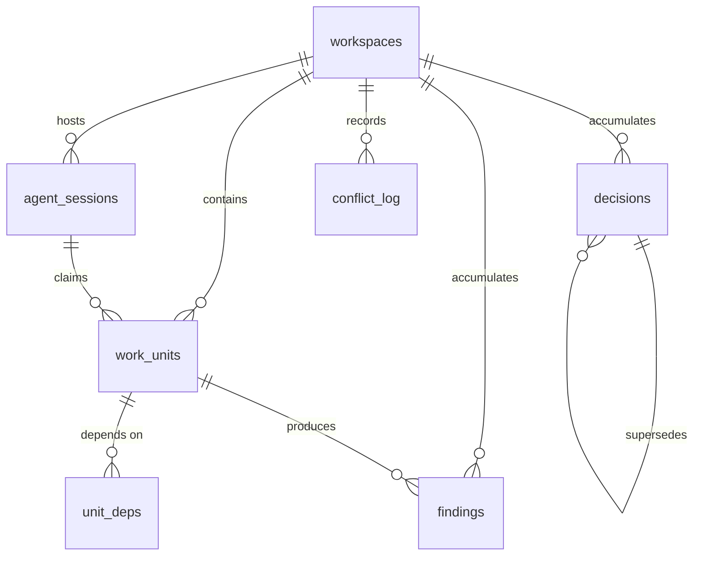

# Architecture

Quorum is a coordination layer, not an agent framework. Its whole job is to make
concurrent agents contend *safely and visibly* over one shared memory. This
document explains the pieces and, more importantly, why each one is where it is.

---

## 1. The shape of the problem

Give N agents one large task and a shared memory, and three failures appear that
do not exist with a single agent:

| Failure | What it looks like | What actually went wrong |
|---|---|---|
| **Claim conflict** | Two agents migrate the same file; one result silently overwrites the other | No isolation between read-then-write |
| **Semantic conflict** | Two agents independently adopt incompatible conventions | No mechanism to notice that two *differently worded* conclusions collide |
| **Invalidation cascade** | An agent discovers something that makes finished work wrong; nothing re-runs | No transactional way to walk dependencies and re-queue |

All three are concurrency-control problems. That is why the database is the
architecture rather than a place to keep JSON.

---

## 2. Component map



Everything domain-specific is behind `decompose/`. Everything
correctness-critical is behind `db.py`. The two never mix: the engine only ever
sees work units, dependency edges, and decision scopes.

---

## 3. Data model

Seven tables, each carrying one part of the coordination story.



| Table | Role | The load-bearing column |
|---|---|---|
| `workspaces` | One concurrent task | `mode` — `safe` or `naive`, the A/B switch |
| `agent_sessions` | Who is alive | `heartbeat_at` — liveness, so a dead agent's lease can be reclaimed |
| `work_units` | The contended resource | `claimed_by` + `claim_expires_at` — the lease; `version` — bumped on invalidation |
| `unit_deps` | Cascade edges | reverse index, so "who depends on this?" is cheap |
| `decisions` | Cross-cutting conclusions | `embedding VECTOR(1024)` + `status` + `supersedes_id` |
| `findings` | Discoveries | `invalidates BOOL` — the cascade trigger |
| `conflict_log` | **Proof that contention happened** | `kind`, `agents UUID[]`, `detail JSONB`, `resolution` |

`conflict_log` is treated as a first-class output, not telemetry. A coordination
layer that resolves conflicts silently is indistinguishable from one that never
had any.

### Why the indexes are what they are

```sql
INDEX work_units_expiry_idx (claim_expires_at) WHERE status = 'claimed'
```
The lease reaper asks one question: which claims have expired? A partial index
answers it without touching units that are not claimed.

```sql
INDEX unit_deps_reverse_idx (depends_on_unit_id)
```
The primary key `(unit_id, depends_on_unit_id)` serves "what does A depend on?".
The cascade asks the opposite question, on every hop of a transitive walk.

```sql
VECTOR INDEX decisions_embedding_idx (workspace_id, embedding vector_cosine_ops)
```
Nearest-neighbour search over prior decisions, scoped by a prefix column so one
workspace never searches another's decisions. Cosine because Titan Text
Embeddings V2 returns normalised vectors and direction is what matters.

---

## 4. The three mechanisms

### 4.1 Claim: serializable lease

```sql
BEGIN;                                    -- SERIALIZABLE (CockroachDB default)
SELECT id, version FROM work_units
 WHERE workspace_id = $1 AND status = 'pending'
 ORDER BY … LIMIT 1
   FOR UPDATE;                            -- serialise the racers
UPDATE work_units
   SET status = 'claimed', claimed_by = $2,
       claim_expires_at = now() + $lease
 WHERE id = $3;
COMMIT;
```

Two agents racing produce one winner and one `40001` for the loser, which
retries and takes a different unit. Both outcomes are recorded in
`conflict_log`, so contention is measured rather than assumed.

**Leases, not locks.** A lock held by a crashed agent is a deadlocked workspace.
A lease held by a crashed agent expires and is reclaimed, with the `version`
bump making the abandoned attempt detectable.

### 4.2 Semantic guard: ANN pre-check, then a judge

```
embed(statement)
  → ANN query in (workspace_id, scope) over decisions
  → neighbours above cosine threshold?
      → Bedrock classifies: agrees | contradicts | unrelated
          → contradicts: reconcile, supersede the loser, cascade from it
```

The vector index is what makes this possible at all. "Standardise on `httpx`"
and "keep the `requests` adapter for unix sockets" share no keywords and are
directly opposed. Embeddings catch it; `LIKE` never will.

The LLM is deliberately downstream of the index: ANN narrows thousands of
decisions to a handful, and only that handful costs a model call.

**Classify first, deduplicate second.** A near-duplicate gate placed *before*
contradiction classification is a documented way to lose real conflicts
silently: contradiction and near-duplication look identical to cosine distance,
so a dedup check rejects the contradictory write as "too similar to an existing
decision" and the contradiction detector never sees it. Only the classifier can
tell the two apart, so nothing may be dropped on similarity alone before it has
been classified.

This is also why the stub backend cannot stand in for the classifier. Its
embeddings are lexical, and it scores "standardise on httpx" against "keep
requests for the unix socket transport" as *unrelated* — they share no words —
when they are in fact directly opposed. `test_stub_similarity_is_lexical_not_semantic`
asserts that limitation so nobody trusts it by accident.

### 4.3 Cascade: one transaction, or none

```
finding.invalidates = true  (or a decision is superseded)
  → walk unit_deps transitively from the invalidated node
  → dependents: status → 'stale', version += 1, re-queued
  → all of it in ONE serializable transaction
```

A partially applied cascade — three dependents re-queued, two left `done` — is
precisely the corrupt state Quorum exists to prevent. It commits whole or not at
all. The walk carries a visited set, because a real import graph contains
cycles.

---

## 5. `safe` vs `naive`

`workspaces.mode` swaps the guarantees, and nothing else:

| | `safe` | `naive` |
|---|---|---|
| Claim | serializable txn + `FOR UPDATE` + lease | autocommit `UPDATE`, no locking |
| Retry on `40001` | whole transaction replayed | none |
| Decision write | ANN pre-check, then classify | straight insert |
| Invalidation | transactional transitive cascade | none |

Same task, same agents, same seed. `naive` is expected to produce duplicated
work, contradictory decisions both marked `active`, and stale results that never
get re-queued. `quorum compare` runs both and diffs the outcomes into a report,
reproducibly and on demand.

This is why `db.py` exposes `run_autocommit` alongside `run_serializable`. The
weak path is a feature: without a control group, "CockroachDB is load-bearing"
is an assertion rather than a result.

---

## 6. Execution model

An agent worker is a loop:

```
register session → claim unit → read context (via MCP)
    → reason (Bedrock) → write decision (semantic guard)
    → write finding + artifact → release unit → heartbeat → repeat
```

The worker entrypoint is Lambda-shaped from the start — a handler taking an
event, returning a result — so the local runner and the Lambda runner execute
the same code. Heartbeats are what let the reaper distinguish "slow" from
"dead": a session that stops heartbeating has its leases expire, and its units
return to the pool.

## 7. Local and cloud profiles

| | local | cloud |
|---|---|---|
| Database | single node in `.tools/` | CockroachDB Cloud |
| Reasoning | stub (deterministic) | Amazon Bedrock |
| Workers | subprocesses | AWS Lambda |
| Artifacts | `artifacts/` | Amazon S3 |

One environment variable per axis, resolved once in `config.py`. Cloud is never
a hard dependency for iteration, and the local path keeps working after the
cloud path exists.

---

## 8. Decisions worth defending

**Decomposition is a plugin.** Code migration is a vehicle. Hard-coding it would
make Quorum a migration tool with a database attached, which is the opposite of
the claim.

**Dependency edges come from the real import graph**, parsed with `ast`, not
guessed from directory structure. A cascade that walks invented edges proves
nothing.

**Structured JSON logging from the first commit.** Coordination events are only
useful if they can be replayed afterwards, and the log doubles as the
observability story.

**Retries are counted, not hidden.** `TxnStats` reports attempts, retries,
commits, and failures per transaction label. Under contention, retries are the
visible price of serializability — the number to show, not to suppress.
